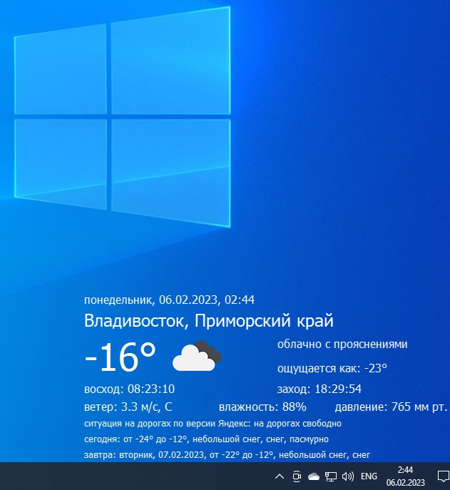

# Senex
Прогноз погоды (openweathermap) и информация о пробках от Яндекса

Для работы программы необходим бесплатный API openweathermap. Получить его можно после регистрации на официальном сайте https://openweathermap.org/

ВНИМАНИЕ! После получения API сервера Openweather начинают с ним работать через несколько часов, лучше проверять через сутки.
свой API необходимо указать в файле const.py


Приложение работает как виджет, закрытие программы можно выполнить, нажав правой кнопкой на значек в трее

Внешний вид запущенного приложения:



Из ограничений можно выделить следующее:
```
*Только русские населенные пункты, теоретически другие страны будут работать, но город отображаться не будет. [Не баг, а фича;)]

*Яндекс выдает сводку о дорожной ситуации только в некоторых городах, если ваш город не в их числе,
будет выводиться сообщение "нет информации"

*Сам openweather выдает только населенный пункт, в базу собрал все города, но прицепить ко всем регионы задача не совсем простая,
хотя выполнимая, поэтому некоторые основные города добавил и решил на этом остановиться.
Если кто-то подскажет lat, lon всех регионов России, то можно обновить
```
В остальном приложение вполне работоспособно, сильно не проверял, но если вдруг отрубили интернет до 5 дней будет показывать текущую погоду, дальше скорее выпадет на ошибку.

О названии: Роберт Фицрой, родоначальник прогноза погоды, публиковал в журнале Times другие свои работы под псевдонимом Senex. Поскольку стандартные названия типо Weather, Meteo и т.п. заняты, пусть приложение тоже называется Senex.
